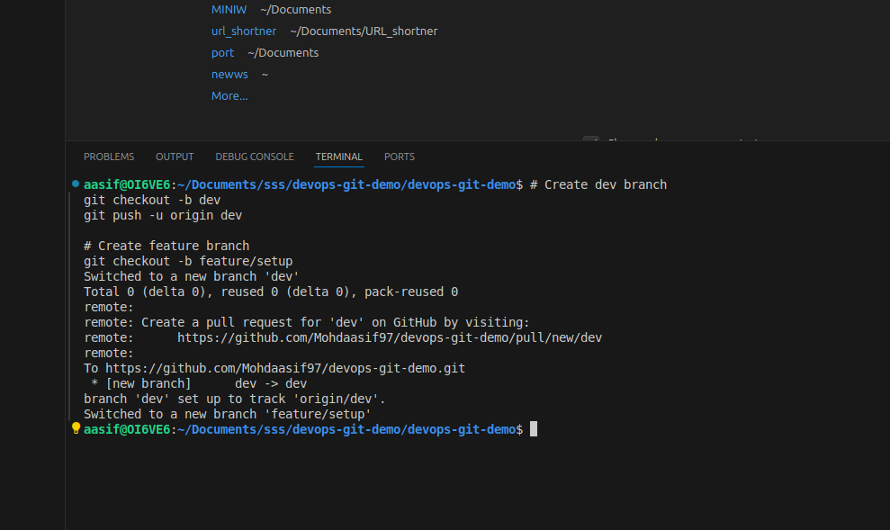
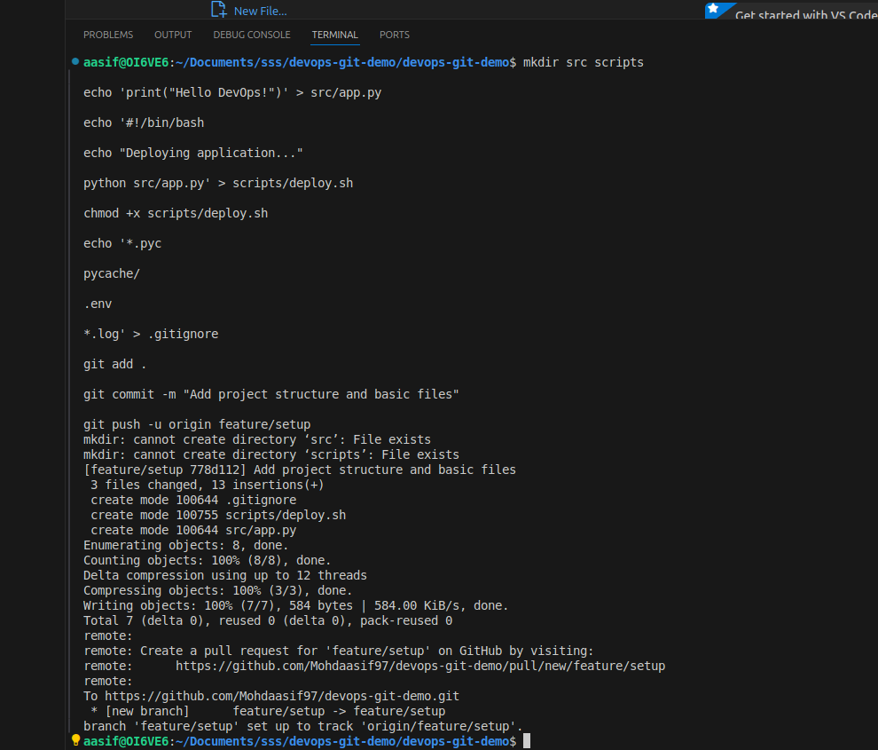
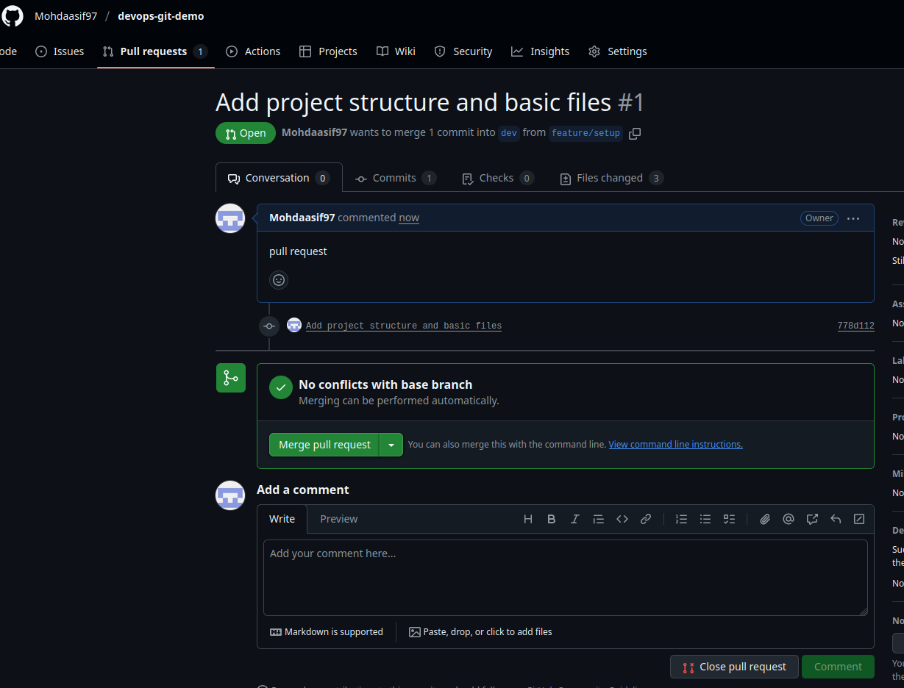
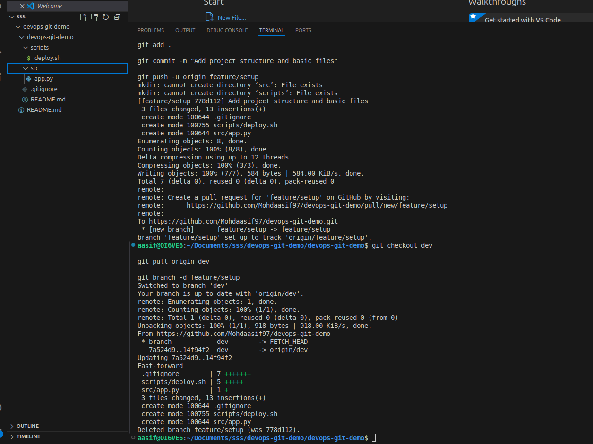
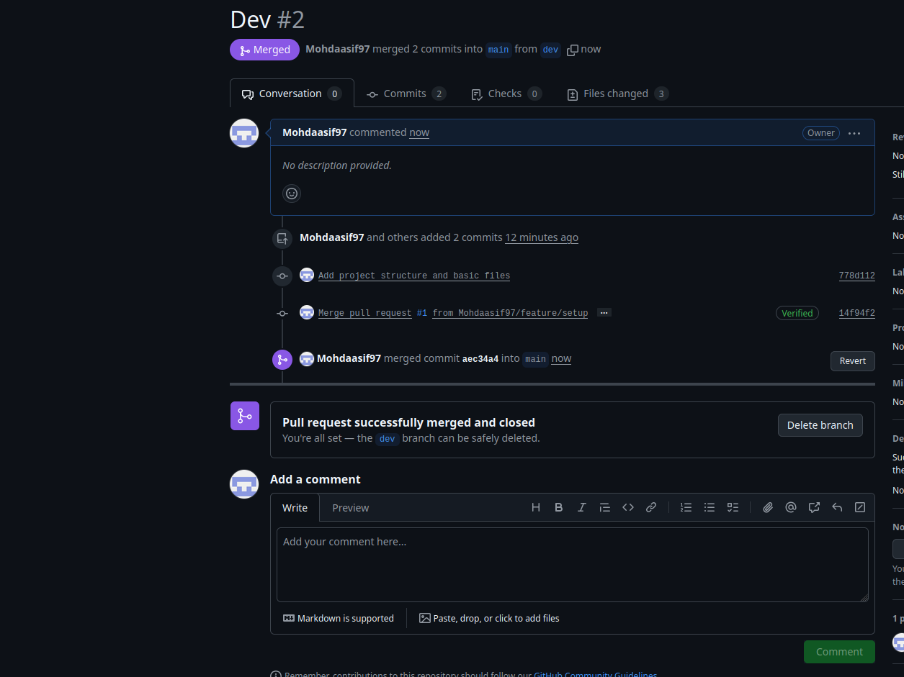

# DevOps Git Demo

## About
I created this project to practice Git workflows and DevOps concepts.

## What I Did
- Set up Git repository with proper branching
- Created `main`, `dev`, and `feature` branches
- Used pull requests to merge changes
- Added deployment script and documentation

## Project Structure
```
devops-git-demo/
├── src/app.py
├── scripts/deploy.sh
├── README.md
└── .gitignore
```

## Git Workflow I Used

### 1. Created Dev and feature Branch


### 3. adding features


### 3. Merged Feature to Dev


### 2. merged successfully


### 4. Merged Dev to Main


## Usage
```bash
# Run the app
python src/app.py

# Deploy
./scripts/deploy.sh
```

## What I Learned
- Git branching strategies
- Pull request workflow
- DevOps best practices
- Project documentation

## Technologies
- Git & GitHub
- Python
- Bash scripting

---
Created by [@Mohdaasif97](https://github.com/Mohdaasif97)
